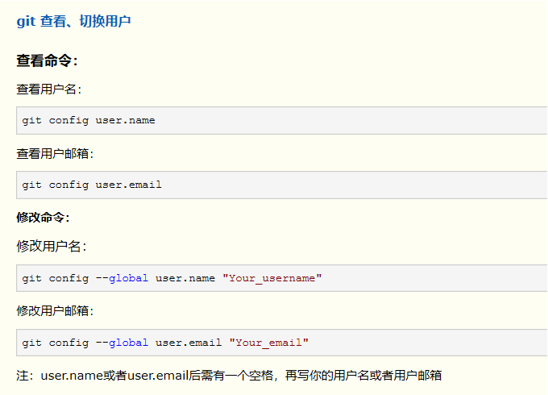

# Git 常用语法

- `git add -A `(提交所有的改动)
- `git add . ` (提交当前目录的改动)
- ` git branch -M main  ` 新建一个主分支
- `git push -u origin/master` 第一次网远程分支推送代码   
- 修改以及查看用户信息 

## 如何新建一个本地仓库提交到远程
-  先在git创建一个仓库（不勾选创建readme.md ，直接creat，然后会有一些操作提示）
-  在本地新建一个文件 `mkdir study`
-  `code .` (在当前目录下打开vscode)
-  `control n` 创建一个文件夹，在第一行输入
-  `control shift ` ` 打开 vscode 内部的 terminal 
-  ` git init `
-  `git add —A ` (提交所有的改动)
- ` git commit -m "init" `
- `git push origin master ` 推到远程分支

## 强制远程分支覆盖本地分支

## 修改commit

## squash

## rebase

## merge

## cherry-pick

##  git reset --soft
-  `git reset --soft xxxx(commit id)`
-  回退到之前的某个commit，但是之前的修改还在，但是一个未commit的状态

## git checkout -B

这个命令，可以强制创建新的分支。

如果当前仓库中，已经存在一个跟你新建分支同名的分支，
那么使用普通的git checkout -b 这个命令，是会报错的，且同名分支无法创建。

如果使用-B参数，那么就可以强制创建新的分支，并会覆盖掉原来的分支。

## git fetch --all  
回远程所有修改

## 强制把改动推到指定分支
- `git push -f origin HEAD:user/xinyi/NT2ADR-907`  //强推代码到某一指定分支

